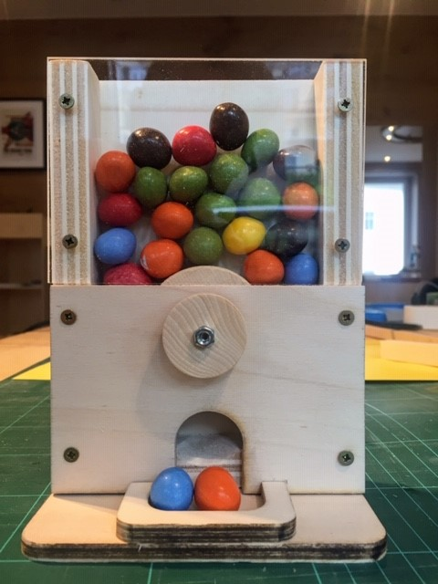
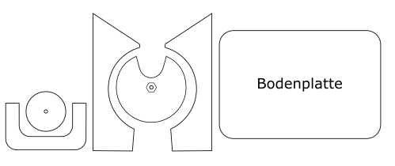
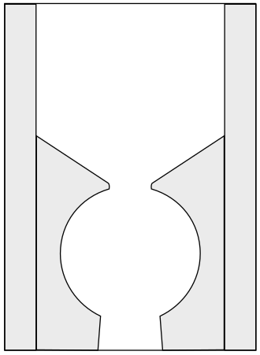
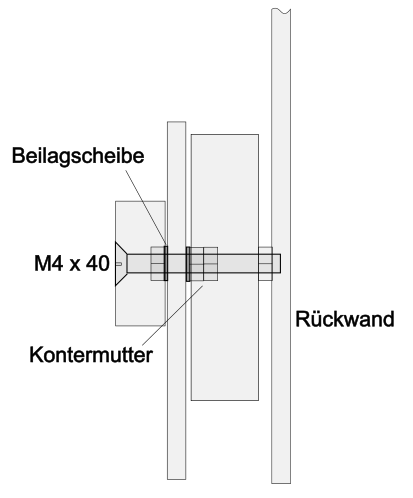
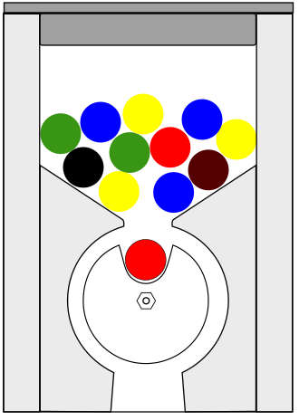

|[:skull:ISSUE](https://github.com/frankyhub/MM-Spender/issues?q=is%3Aissue)|[:speech_balloon: Forum /Discussion](https://github.com/frankyhub/MM-Spender/discussions)|[:grey_question:WiKi](https://github.com/frankyhub/MM-Spender/wiki)||
|--|--|--|--|
| | | | |
||<a href="https://github.com/frankyhub/MM-Spender/issues">|<a href="https://github.com/frankyhub/MM-Spender/discussions">|<a href="https://github.com/frankyhub/MM-Spender/releases">|
|| <a href="https://github.com/frankyhub/MM-Spender/pulse" alt="Activity">| <a href="https://github.com/frankyhub/MM-Spender/graphs/traffic">  |<a href="https://github.com/frankyhub?tab=stars"> |

# MM-Spender
Holz Bastelarbeit

## Arbeitsschritte:

1.	 Die 3 Drehräder, die4 Auswurfräder, die 3 Auffang-Teile, die 4 Seitenteile und die beiden Bodenplatten zusammenkleben.

2.	Alle Teile entgraten und die Stirnseiten sauber abschmirgeln. Es dürfen keine schwarzen Laserkanten mehr zu sehen sein!
   
3.	Die seitlichen Leisten und die Innenteile auf die Rückwand kleben.

   

4.	Den Drehmechanismus montieren.
 
   
 
5.	Die Frontplatte mit dem Drehmechanismus auf den Grundkörper mit den Leisten legen und den Auswurfmechanismus testen.

6.	Wenn der Auswurfmechanismus funktioniert, die Frontplatte auf den Grundkörper schrauben (3x12mm).

7.	Anschließend die Acrylglasplatte auf den Grundkörper schrauben (3x12mm).

8.	Den Grundkörper auf die Bodenplatte kleben und verschrauben (3x16mm).

9.	Den Erdnussspender befüllen und testen.

10.	Optional kann noch ein Deckel montiert werden.
	
    
                                         Fertig, Glückwusch!

---

   
<ol class="breadcrumb" style="border-top: 2px solid black;border-bottom:2px solid black; height: 45px; width: 900px;"> 
<a href="#oben">nach oben</a>
</ol>

  

---
